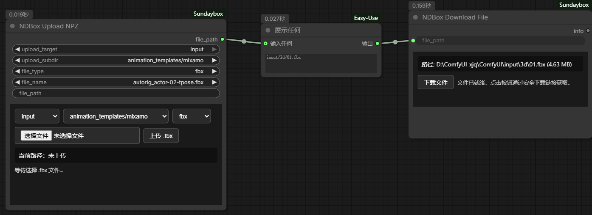
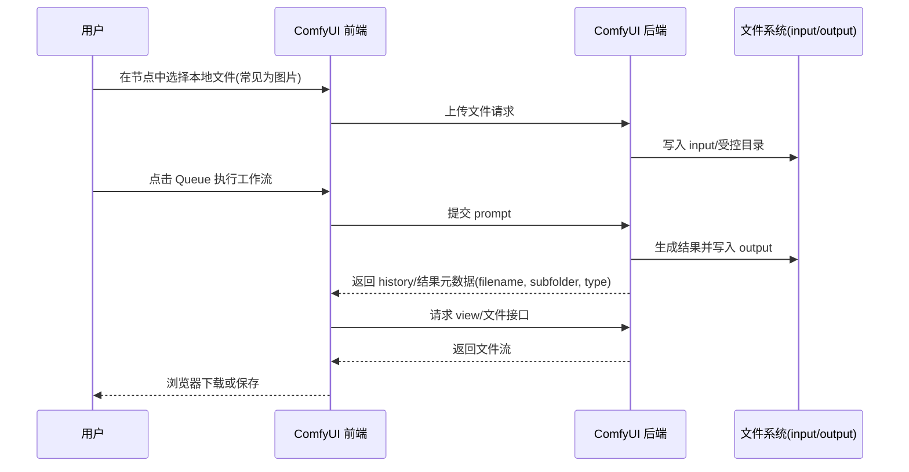
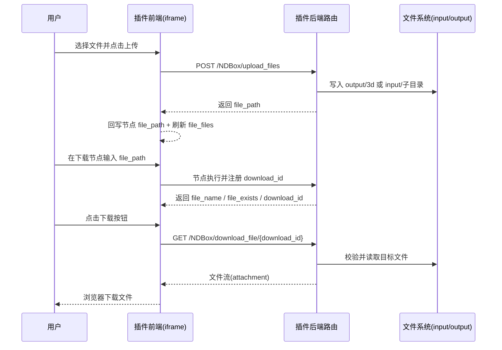

# ComfyUI-Sundaybox



`ComfyUI-Sundaybox` 是一个面向 ComfyUI 的实用插件，当前提供两个节点：

- `NDBox_UploadFiles`：在节点面板内上传本地文件到 ComfyUI 目录。
- `NDBox_DownloadFile`：通过安全下载令牌下载服务端文件（不直接暴露真实路径）。

## 功能特性

- 节点内嵌前端 UI（iframe）完成上传/下载操作。
- 上传支持多种扩展名过滤：`any`、`npz`、`npy`、`json`、`txt`、`csv`、`bvh`、`fbx`、`obj`、`glb`。
- 上传目标支持 `output` / `input`。
- 下载使用短期 `download_id`，前端不暴露服务器绝对路径。
- 历史文件列表支持按类型刷新，上传后可立即更新下拉项。

## 目录结构

```text
ComfyUI-Sundaybox/
├─ __init__.py
├─ nodes/
│  ├─ NDBoxUploadFile.py
│  └─ NDBoxDownloadFile.py
└─ web/
   ├─ NDBoxUploadFile.html
   ├─ NDBoxUploadFile.js
   ├─ NDBoxDownloadFile.html
   └─ NDBoxDownloadFile.js
```

## 安装方式

1. 将本仓库放到 ComfyUI 的 `custom_nodes` 目录下：
   - `ComfyUI/custom_nodes/ComfyUI-Sundaybox`
2. 重启 ComfyUI。
3. 打开前端后搜索节点：
   - `NDBox Upload NPZ`
   - `NDBox Download File`

## 节点说明

### 1) NDBox_UploadFiles

用于上传本地文件并输出相对路径（例如 `output/3d/demo.npz`）。

主要输入参数：

- `upload_target`：上传到 `output` 或 `input`。
- `upload_subdir`：当 `upload_target=input` 时可选子目录。
- `file_type`：上传后缀限制。
- `file_name`：历史文件下拉项。
- `file_path`：当前文件路径（可由上传自动写入）。

输出：

- `file_path`（`STRING`）：上传后的相对路径或当前选中文件路径。

### 2) NDBox_DownloadFile

输入服务器文件路径，生成下载信息并在前端提供下载按钮。

主要输入参数：

- `file_path`：要下载的文件路径（可绝对路径，也可相对 `output/input` 路径）。

输出：

- `info`（`STRING`）：包含文件名、存在性、大小、下载令牌等信息。
- `download_url`（`STRING`）：本次注册的下载链接（在可读取 ComfyUI 启动参数时为 `http://主机:端口/NDBox/download_file/{download_id}`，否则为同源可用的路径 `/NDBox/download_file/{download_id}`）。

## HTTP 路由一览

| 方法 | 路径 | 说明 |
|------|------|------|
| `POST` | `/NDBox/upload_files` | multipart 上传文件 |
| `GET` | `/NDBox/list_uploaded_files` | 按类型列出历史文件名 |
| `GET` | `/NDBox/list_input_subdirs` | 列出 input 下可选子目录 |
| `GET` | `/NDBox/resolve_file_path` | 将下拉文件名解析为相对路径 |
| `GET` | `/NDBox/download_file/{download_id}` | 按节点注册的令牌下载（一次性） |
| `GET` | `/NDBox/download_file_by_filepath` | 在 input/output/user 目录内按相对路径下载 |

以下接口与 ComfyUI Web 服务同源（默认例如 `http://127.0.0.1:8188`），请将示例中的 `BASE_URL` 换成你的实际地址。

## HTTP 接口使用说明

### 1) `POST /NDBox/upload_files`

**Content-Type：** `multipart/form-data`

**表单字段：**

| 字段 | 必填 | 说明 |
|------|------|------|
| `file` | 是 | 文件字节流，`filename` 作为原始文件名 |
| `file_type` | 否 | `any`、`npz`、`npy`、`json` 等，见上文节点说明；默认由服务端处理 |
| `upload_target` | 否 | `output` 或 `input`，默认 `output` |
| `upload_subdir` | 否 | 仅 `upload_target=input` 时有效；子目录会经服务端规范化 |

**成功响应 JSON：** `{"ok": true, "file_path": "output/3d/xxx.npz", "size": 12345}`  
**失败：** `{"ok": false, "error": "..."}`，HTTP 4xx/5xx。

**存储规则简述：** `output` 固定写入 `output/3d/`；`input` 写入 `input/<upload_subdir>/`。

---

### 2) `GET /NDBox/list_uploaded_files`

**查询参数：**

| 参数 | 说明 |
|------|------|
| `file_type` | 可选，默认 `any`；与上传支持的类型一致 |

**成功响应：** `{"ok": true, "files": ["none", "a.npz", ...]}`（列表内容与扫描目录有关）。

---

### 3) `GET /NDBox/list_input_subdirs`

无必填参数。

**成功响应：** `{"ok": true, "subdirs": ["3d", "NDBox_npz", ...]}`。

---

### 4) `GET /NDBox/resolve_file_path`

用于把节点里「历史文件名」解析成插件统一的相对路径字符串（如 `output/3d/demo.npz`）。

**查询参数：**

| 参数 | 说明 |
|------|------|
| `upload_target` | `output` / `input`，默认 `output` |
| `upload_subdir` | `input` 时的子目录，默认 `3d` |
| `file_name` | 文件名或下拉项；`none` 表示未选 |

**成功响应：** `{"ok": true, "file_path": "output/3d/demo.npz"}`（找不到时 `file_path` 可能为空或退回传入值，取决于服务端解析逻辑）。

---

### 5) `GET /NDBox/download_file/{download_id}`

由 **`NDBox_DownloadFile` 节点执行成功后** 在内存中注册的短期令牌；**成功下载一次后即失效**（单次使用）。

**路径参数：** `download_id`（UUID hex，无分隔符）。

**成功：** 返回文件流，`Content-Disposition: attachment`。  
**失败：** JSON `{"ok": false, "error": "..."}`。

---

### 6) `GET /NDBox/download_file_by_filepath`

在服务端允许的根目录内，按**相对路径**读取文件并附件下载；**禁止**传入绝对路径；路径经规范化后必须落在对应根目录内（防止 `../` 穿越）。

**查询参数：**

| 参数 | 说明 |
|------|------|
| `target_type` | `input` / `output` / `user_data`（也可用别名 `upload_target`），默认 `output` |
| `file_path` | **必填**，相对路径；若以 `input/`、`output/`、`user_data/` 开头且与 `target_type` 一致时会去掉前缀后再拼接 |
| `user_id` | 仅 `target_type=user_data` 时使用，默认 `default`（对应 ComfyUI `user/<user_id>/`） |

**成功：** 文件流 + `attachment` 文件名。  
**失败：** `400`（参数非法）、`403`（路径越界）、`404`（文件不存在）等，Body 多为 JSON。

**安全提示：** 该接口能下载你有权限访问到的 input/output/user 下的文件，请勿在不可信公网环境中裸暴露 ComfyUI；建议仅在可信网络或反代鉴权后使用。

## 调用示例（代码）

下列示例中：

```text
BASE_URL=http://127.0.0.1:8188
```

请按你的监听地址与端口修改。

### cURL

```bash
# 上传文件到 output/3d/
curl -sS -X POST "${BASE_URL}/NDBox/upload_files" \
  -F "file=@./demo.npz" \
  -F "file_type=npz" \
  -F "upload_target=output" \
  -F "upload_subdir=3d"

# 列出 npz 历史文件名
curl -sS "${BASE_URL}/NDBox/list_uploaded_files?file_type=npz"

# 解析下拉文件名 → 相对路径
curl -sS "${BASE_URL}/NDBox/resolve_file_path?upload_target=output&upload_subdir=3d&file_name=demo.npz"

# 按相对路径下载（output 根目录下的 3d/demo.npz）
curl -sS -OJ "${BASE_URL}/NDBox/download_file_by_filepath?target_type=output&file_path=3d%2Fdemo.npz"

# 按 download_id 下载（需先用节点生成有效 id，且未使用过）
curl -sS -OJ "${BASE_URL}/NDBox/download_file/YOUR_DOWNLOAD_ID_HEX"
```

### Python（requests）

```python
import requests

BASE = "http://127.0.0.1:8188"

# --- 上传 ---
with open("demo.npz", "rb") as f:
    r = requests.post(
        f"{BASE}/NDBox/upload_files",
        files={"file": ("demo.npz", f, "application/octet-stream")},
        data={
            "file_type": "npz",
            "upload_target": "output",
            "upload_subdir": "3d",
        },
        timeout=120,
    )
r.raise_for_status()
print(r.json())  # {"ok": True, "file_path": "output/3d/demo.npz", "size": ...}

# --- 历史列表 ---
r = requests.get(f"{BASE}/NDBox/list_uploaded_files", params={"file_type": "npz"}, timeout=30)
print(r.json())

# --- 解析 file_name → file_path ---
r = requests.get(
    f"{BASE}/NDBox/resolve_file_path",
    params={
        "upload_target": "output",
        "upload_subdir": "3d",
        "file_name": "demo.npz",
    },
    timeout=30,
)
print(r.json())

# --- 按相对路径下载到本地 ---
params = {"target_type": "output", "file_path": "3d/demo.npz"}
with requests.get(f"{BASE}/NDBox/download_file_by_filepath", params=params, stream=True, timeout=120) as r:
    r.raise_for_status()
    with open("saved_demo.npz", "wb") as out:
        for chunk in r.iter_content(chunk_size=1024 * 256):
            if chunk:
                out.write(chunk)

# --- 按 download_id 下载（从节点输出的 download_url 中截取 id 或自建 URL）---
download_id = "YOUR_DOWNLOAD_ID_HEX"
r = requests.get(f"{BASE}/NDBox/download_file/{download_id}", timeout=120)
r.raise_for_status()
with open("via_token.npz", "wb") as out:
    out.write(r.content)
```

### 浏览器（fetch，与 ComfyUI 同源）

```javascript
// 上传（页面与 ComfyUI 同一 origin 时可直接 fetch）
async function uploadNpz(file) {
  const fd = new FormData();
  fd.append("file", file, file.name);
  fd.append("file_type", "npz");
  fd.append("upload_target", "output");
  fd.append("upload_subdir", "3d");
  const res = await fetch("/NDBox/upload_files", { method: "POST", body: fd });
  const data = await res.json();
  if (!data.ok) throw new Error(data.error || res.statusText);
  return data.file_path;
}

// 拉取历史列表
async function listNpz() {
  const res = await fetch("/NDBox/list_uploaded_files?file_type=npz");
  return res.json();
}

// 触发浏览器下载（按相对路径接口）
function downloadByFilepath(targetType, relativePath) {
  const q = new URLSearchParams({ target_type: targetType, file_path: relativePath });
  window.open(`/NDBox/download_file_by_filepath?${q.toString()}`, "_blank");
}
```

## 使用建议

- 上传节点建议新建后再使用，确保前端脚本和 iframe 已更新到最新版本。
- 页面更新后若 UI 未同步，建议浏览器强制刷新（`Ctrl+F5`）。
- `download_id` 设计为短期/一次性使用，适合前端安全下载场景。

## 流程对比（原生 vs 本插件）

### 1) ComfyUI 原生常见流程（无本插件）



### 2) 使用本插件的流程



### 3) 差异总结

- 原生流程更偏向图像等标准输入输出，通用文件管理能力较弱。
- 本插件提供节点内上传/下载 UI，支持更多文件类型与目录策略。
- 本插件下载通过 `download_id` 进行安全映射，避免前端直接暴露服务器绝对路径。


## 开发备注

- 插件入口通过 `__init__.py` 导出：
  - `NODE_CLASS_MAPPINGS`
  - `NODE_DISPLAY_NAME_MAPPINGS`
  - `WEB_DIRECTORY = "web"`
- 前端扩展名：
  - `NDBox.UploadFiles`
  - `NDBox.DownloadFile`

## 许可


